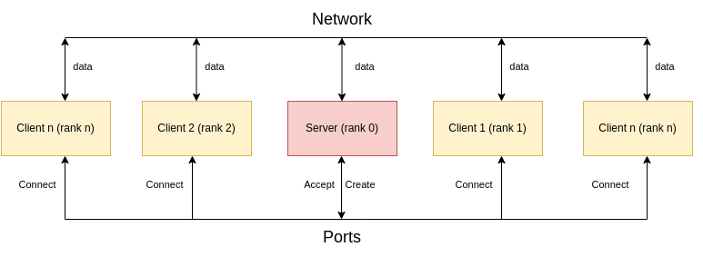
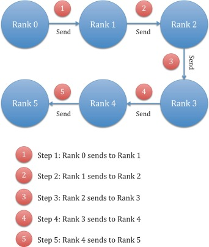
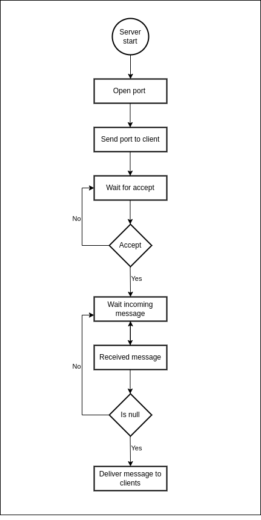
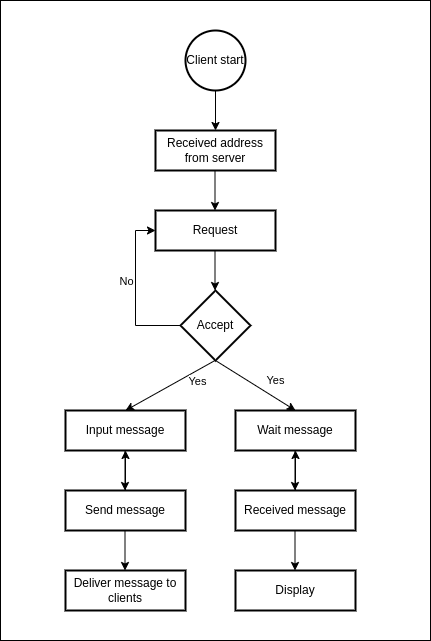
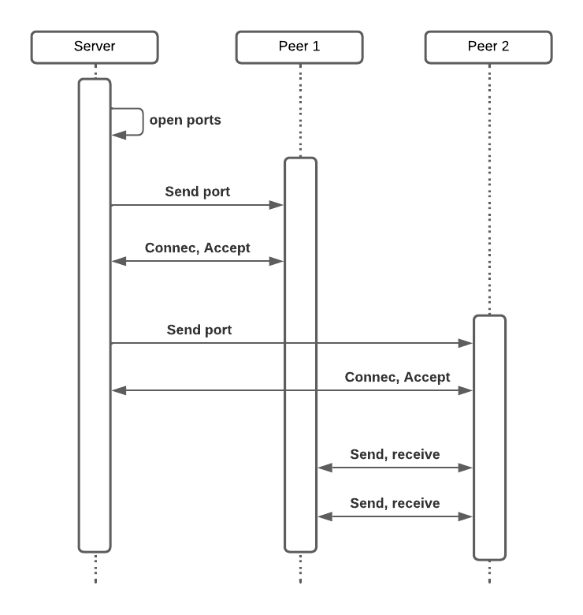
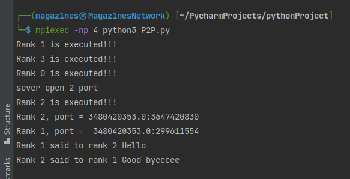
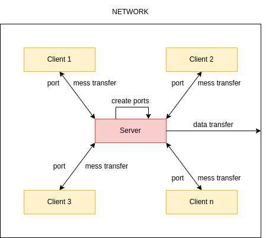
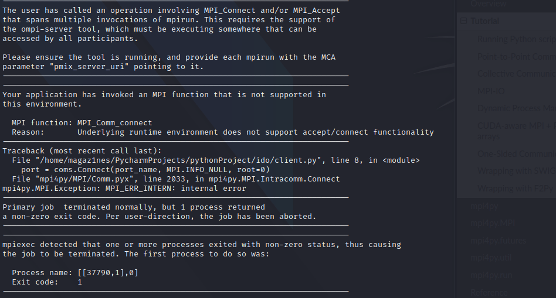

<div align="center">

##### Distributed System

# **Report Project: Hybrid centralized and peer-to-peer chat system using MPI**

&nbsp;

**Group: 12**

**University of Science and Technology of Hanoi**

**Lecturer: Dr.Tran Giang Son**

Feb 2022

&nbsp; &nbsp;

## **Group members**

```
Le Anh Tu | BA9-067

Le Duy | BA9-075

Nguyen Ngoc Khiem | BA9-028

Ly Anh Kiet | BI10-092 

Nguyen Van Cuong | BA9-011
```  

 </div>

## **TABLE OF CONTENTS**

- [I/ Introduction](#intro)
    + [1. What is P2P](#intro1)
    + [2. What is MPI](#intro2)
    + [3. What is Hybrid Centralized?](#intro3)
    + [4. Preparations](#intro4)
- [II/ Analysis and Design](#anlynsis)
- [III/ Implementation](#implementation)
- [IV/ Result](#iv-result)
- [V/ Conclusion and Future work](#conclusion)
    + [1. Conclusion](#con1)
    + [2. Difficulties](#con2)
    + [3. Future work](#con3)

## I/ Introduction <a name="intro"></a>

### 1/ What is P2P <a name="intro1"></a>

Peer-to-peer computing, also known as peer-to-peer networking, is a distributed application architecture that divides
tasks or workloads among peers. Each computer in a peer-to-peer (P2P) network serves as both a server and a client,
supplying and receiving files, with bandwidth and processing shared among all network members. Without the need for
central coordination by servers or stable hosts, peers make a portion of their resources, such as processing power, disk
storage, or network bandwidth, directly available to other network participants. Peers are both resource suppliers and
consumers, in contrast to the traditional client–server model, which divides resource consumption and supply.

### 2/ What is MPI <a name="intro2"></a>

MPI is a standardized and portable message-passing system for distributed and parallel computing.

- MPI gives parallel hardware vendors a well-defined base set of routines that can be implemented quickly.
- As a result, hardware vendors can build higher-level routines for the distributed-memory communication environment
  provided with their parallel machines using this collection of standard low-level routines.
- MPI has several advantages over older message passing libraries, including portability and speed.
    + Simplicity: Traditional communication operations form the foundation of the MPI paradigm.
    + Generalizability: It can be used on almost any system with a parallel architecture.
    + Speed: The implementation can match the underlying hardware's speed.
    + Scalability: The same program can be run on larger systems without any modifications.

### 3/ What is Hybrid Centralized? <a name="intro3"></a>

- Peers search each other via a central server.
- The central server maintains peers' information and connection.

### 4/ Preparations <a name="intro4"></a>

- OS: Linux
- Environment: Python 3.9
- Storage: Github
- IDE: Pycharm
- Library: Mpi4py

## II/ Analysis and Design<a name="anlynsis"></a>

First, we have to do a system analysis because the various tasks involved in conducting the analysis provide an avenue
for finding solutions in the system The overall quality of a system can be easily modified or improved through these
various tasks, and the number of errors can be reduced as a result.<br>
Then the system should satisfy the requirement:

- At least three nodes:
    - One for server
    - Two for client
- A good network
- The port quantity corresponds to the client quantity
- Point-to-Point communication
- Multi-threading
- Blocking communication

With MPI, we can have as many nodes as we want depending on how big our network is. However, there is always a node
whose function is to control all messages from the rest of the nodes and that is the central node or server. The
remaining nodes of the system must be run on different computers or processors connected through a network. Each node (
including the server) must be run as a separate program on different terminal tabs or devices. As is obvious the nodes
must be connected in a stable way.

A port is a virtual point where network connections start and end. Ports are software-based and managed by a computer's
operating system. Each port is associated with a specific process or service. Each port acts as a secure channel so that
the server and client can communicate securely because the port address is randomly generated and sent to the client
very securely via special tags. These ports can be the foundation for later advanced functions such as 1vs1 chat,
private chat, ...

<div align="center">
<br>
Figure 1: System Design
</div>

Messages are sent between two MPI processes using MPI point-to-point communication. A send operation is performed by one
process, while a matching read is performed by the other. MPI guarantees that all messages will arrive in perfect
condition. When using MPI, caution is advised because deadlock can occur if the send and receive operations do not
match. When the send and receive operations do not match, a deadlock occurs, in which neither the sending nor receiving
process can proceed until the other completes its action.

The blocking methods send() and recv() are commonly used to send messages between two MPI processes. Blocking indicates
that the sending process will wait until the entire message has been correctly sent, and the receiving process will wait
until the entire message has been correctly received. These two methods can be used to create more complex communication
methods.

<div align="center">
<br>
Figure 1: System Design
</div>

## III/ Implementation <a name="implementation"></a>

### 1. Server side

<div align="center">
<br>
Figure 2: Server flowchart 
</div>

As for the server, it was born as a central processor of this system. First, the server will randomly open different
ports and send it to a every specific client. Through that address the client can connect to the server and send
information on a secure separate channel. After that, the message will be sent to all clients that have been accepted by
the server

### 2. Client side

<div align="center">
<br>
Figure 3: Client flowchart 
</div>

Clients or nodes need to connect to the server using the address that was sent at start. A client has two main tasks
executed in parallel. First, the client must be able to send messages and be able to receive messages from other nodes
in parallel.

### 3. System Sequence

The system sequence is shown as the figure below:
<div align="center">
<br>
Figure 3: Client flowchart 
</div>

## IV/ Result

<div align="center">
<br>
Figure 4: Result
</div>

In this project we were not able to execute all of the ideas that were planned in advance because of a number of reasons
that we will clarify in section V. Basically, we have almost done it. As the requirements, the server opens the ports
and the client connects to them. Functions such as receiving messages, sending messages are met. but we haven't been
able to separate the nodes into different programs yet so things like user input message from keyboard are not done yet
but our system is still satisfactory.

## V/ Conclusion and Future work

### 5.1/ Conclusion

In this project, we have completed 80% of the basic requirements such as:

- We have a server that is used as a dispatch machine for messages to clients
- Realtime chat
- Centralized peer-to-peer
- Knowledge related to MPI helps us to learn many new things
- Teamwork

But there are still some missing such as:

- Live chat

<div align="center">
<br>
Figure 5: Live Chat Architecture 
</div>

### 5.2/ Difficulties

As mentioned many times before, we had a very strange and rare problem. That's when we want to split the main program
into many different programs (each program represents a node). Mpi4py reports that we cannot do so without the support
of a library called ompi-server. Ompi-server as far as I know it is an intermediary server that helps the subroutines
inside MPI4py to work. Unfortunately, ompi-server didn't work on our computer. We have researched and found a solution
to this problem but what we got is meaningless. This issue is still being researched and fixed by the developers of
MPI4py, as evidenced by the fact that it has not been closed in the Issue Report section on github, you access the link
below:

- Link: https://github.com/open-mpi/ompi/issues/3458

<div align="center">
<br>
Figure 5: Ompi-server problem
</div>

### 5.3/ Future work

In the future, we will keep continue to finish and add some more features to make this project complete. These are some
future works we will do:

+ Finish Live chat
+ Do user authentication
+ Do Database
